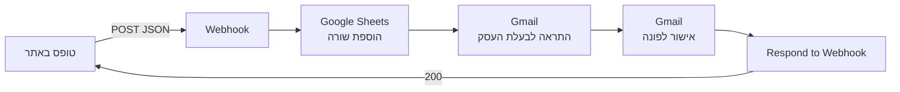

# Moxie — מכבסה עם אווירה

אתר נחיתה עבור **מוקסי**, מכבסה בשכונת הנרקיסים החדשה בראשון לציון.
האתר מציג את שירותי המכבסה ואת שירות האיסוף וההחזרה עד הבית, וכולל טופס יצירת קשר
המחובר לאוטומציה ב‑n8n שמתעדת כל פנייה ושולחת התראות במייל.

אתר סטטי לחלוטין — HTML ו‑CSS בלבד, ללא תלויות, ללא שלב בנייה וללא צד שרת.

---

## תוכן העניינים

- [הרצה מקומית](#הרצה-מקומית)
- [מבנה הפרויקט](#מבנה-הפרויקט)
- [מבנה העמוד](#מבנה-העמוד)
- [טופס יצירת הקשר](#טופס-יצירת-הקשר)
- [הגדרת ה‑webhook](#הגדרת-ה-webhook)
- [שפת העיצוב](#שפת-העיצוב)
- [נגישות ותמיכה ב‑RTL](#נגישות-ותמיכה-ב-rtl)

---

## הרצה מקומית

הפרויקט לא דורש התקנה, אבל **אין לפתוח את `index.html` בלחיצה כפולה**.
פתיחה דרך `file://` גורמת לדפדפן לשלוח `Origin: null`, והשליחה ל‑n8n תיחסם בגלל CORS.

יש להגיש את הקבצים דרך שרת מקומי:

```bash
npx serve
```

ואז לפתוח את הכתובת שתודפס, לרוב `http://localhost:3000`.

לחלופין, בתוך VS Code אפשר להשתמש בתוסף **Live Server**.

---

## מבנה הפרויקט

```
moxie-landing-page/
├── index.html      # מבנה העמוד + הלוגיקה של שליחת הטופס
├── style.css       # כל העיצוב, מבוסס משתני CSS
├── .gitignore
└── README.md
```

שלושה קבצים, ללא `node_modules` וללא תהליך בנייה. כל מה שנדרש כדי להעלות את האתר
לאחסון סטטי — GitHub Pages, Netlify, Cloudflare Pages — הוא להעתיק את התיקייה.

---

## מבנה העמוד

| חלק | תיאור |
|---|---|
| **Hero** | כותרת ראשית, תיאור קצר ושני כפתורי פעולה — הזמנה ב‑WhatsApp והשארת פרטים |
| **על העסק** | פסקת רקע על המכבסה |
| **שירותי מכבסה מלאים** | שלושה כרטיסים: מכבסה מלאה, איסוף והחזרה, שני סבבים ביום |
| **איסוף והחזרה** | הפניה לתהליך ההזמנה ב‑WhatsApp |
| **תהליך פשוט ונוח** | שלושה שלבים ממוספרים: השארת פרטים, יצירת קשר, איסוף והחזרה |
| **ימי הפעילות** | ראשון–חמישי 08:30–18:00, שישי 08:00–13:00 |
| **טופס פנייה** | ששת השדות המפורטים בהמשך |
| **פרטי יצירת קשר** | מיקום, כתובת, טלפון ומייל |

---

## טופס יצירת הקשר

הטופס שולח `POST` בפורמט JSON ל‑webhook של n8n. השליחה מתבצעת ב‑`fetch`
עם `preventDefault`, כך שהעמוד לא נטען מחדש. במהלך השליחה הכפתור ננעל ומוצג
משוב טקסטואלי למשתמש — הצלחה או כישלון.

### השדות הנשלחים

| שדה | סוג | חובה |
|---|---|:---:|
| `name` | טקסט | ✓ |
| `phone` | טלפון | ✓ |
| `email` | מייל | |
| `address` | טקסט | |
| `service` | טקסט עם `datalist` להשלמה | |
| `message` | טקסט חופשי | |

> שדה `service` הוא `input` עם `datalist` ולא `select`, כדי שיירש את אותו עיצוב
> כמו שאר שדות הטופס ויאפשר גם הקלדה חופשית.

### מסלול הנתונים ב‑n8n



כל פנייה מגיעה לשלושה יעדים: שורה חדשה בגיליון, מייל התראה לבעלת העסק,
ומייל אישור אוטומטי לכתובת שהוזנה בטופס.

---

## הגדרת ה‑webhook

כתובת ה‑webhook מוגדרת בקבוע יחיד בראש בלוק ה‑`<script>` ב‑`index.html`:

```js
const N8N_WEBHOOK_URL = "https://<HOST>/webhook-test/moxie-contact";
```

ל‑n8n שתי כתובות נפרדות לאותו workflow:

| מצב | כתובת | מתי פעילה |
|---|---|---|
| **בדיקה** | `/webhook-test/moxie-contact` | רק אחרי לחיצה על **Execute workflow** בעורך, **ולשליחה אחת בלבד** |
| **ייצור** | `/webhook/moxie-contact` | תמיד, לאחר פרסום ה‑workflow |

### מעבר לייצור

1. ב‑n8n — לפרסם את ה‑workflow (**Publish**)
2. ב‑`index.html` — להחליף `/webhook-test/` ב‑`/webhook/`

> **שים לב:** כתובת ה‑webhook גלויה בקוד המקור של העמוד, כמו בכל אתר סטטי
> ששולח נתונים מצד הלקוח. אין בה סוד, אבל מי שימצא אותה יוכל לשלוח פניות.
> ב‑n8n אפשר להוסיף אימות לנוד ה‑Webhook אם נדרשת הגנה.

---

## שפת העיצוב

הפלטה מוגדרת כמשתני CSS ב‑`:root`, כך שאפשר לשנות את כל מראה האתר ממקום אחד:

| משתנה | ערך | שימוש |
|---|---|---|
| `--bg` | `#f7f2ee` | רקע העמוד |
| `--surface` | `#fffdfb` | כרטיסים ומשטחים |
| `--rose` | `#d9a09d` | צבע המותג |
| `--rose-deep` | `#c88782` | כפתורים ומצבי פוקוס |
| `--text` | `#3e3735` | טקסט רגיל |
| `--line` | `#eaded8` | מסגרות ומפרידים |

הגופן הוא מחסנית גופני מערכת — `Segoe UI`, `Tahoma`, `sans-serif` — ללא טעינה
מרשת חיצונית, מה שחוסך בקשת רשת ומונע הבהוב טקסט בטעינה.

הפריסה בנויה על CSS Grid ו‑Flexbox עם שתי נקודות שבירה בלבד: `768px` למעבר
לפריסה רחבה, ו‑`389px` להתאמות במסכים צרים במיוחד.

---

## נגישות ותמיכה ב‑RTL

- `<html lang="he" dir="rtl">` — הכיווניות מוגדרת ברמת המסמך
- HTML סמנטי: `header`, `main`, `section`, `article`
- `aria-label` על אזורים וכפתורים שאין להם טקסט מתאר
- `aria-labelledby` לקישור מקטע לכותרת שלו
- הודעת הסטטוס של הטופס מסומנת ב‑`role="status"` ו‑`aria-live="polite"`,
  כך שקוראי מסך מכריזים עליה בעת שינוי
- כל שדה עטוף ב‑`<label>`, ולכן לחיצה על הכיתוב ממקדת את השדה
- מצבי `:focus` מוגדרים במפורש ואינם מבוטלים

---

## רישיון

פרויקט פרטי עבור מוקסי — מכבסה עם אווירה.
